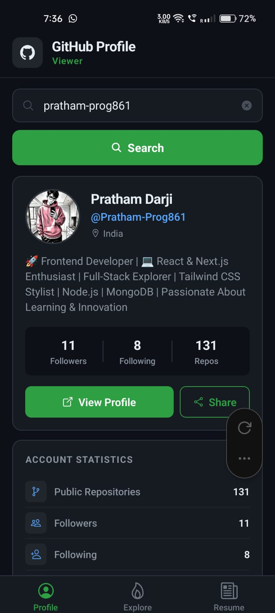
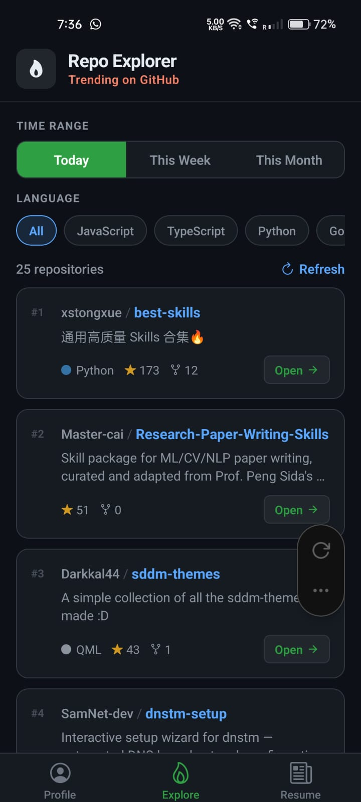
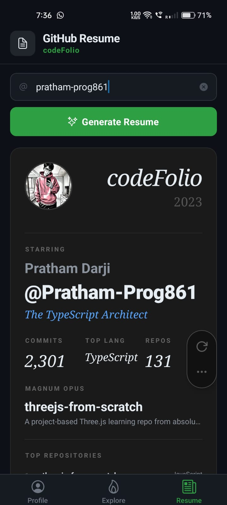

# CodeFolio

A mobile developer portfolio app built with **Expo (React Native)**. Search GitHub developers, explore trending repositories, save your favourite devs, and generate a shareable resume card — all in one place.

<p align="center">
  
</p>

---

## Features

### Splash Screen & Onboarding

- Branded animated splash screen on every launch
- 3-slide horizontal onboarding for first-time users (swipeable with dot indicators)
- AsyncStorage flag skips onboarding for returning users

### GitHub Profile Viewer

- Search any GitHub username and instantly view their profile
- Avatar, real name, bio, location, followers / following stats
- Top 5 repositories sorted by stars
- GitHub contribution graph
- Save developer to your local saved list
- Open profile in browser or share the link

### Repo Explorer

- Browse **trending GitHub repositories** powered by the GitHub Search API
- Filter by time range: Today / This Week / This Month
- Filter by programming language (JavaScript, TypeScript, Python, Rust, Go, and more)
- Each card shows stars, forks, language, and links directly to the repo

### Saved Developers

- Save your favourite GitHub developers locally with AsyncStorage
- View saved developer cards (avatar, name, followers, repos)
- **View Profile** — jump straight to that developer's profile screen
- **Remove** — delete from saved list instantly
- Real-time updates when switching tabs

### GitHub Resume Generator

- Enter a username to auto-generate a **CodeFolio film-card style developer resume**
- Sections: Developer Profile · GitHub Stats · Top Repositories · Top Languages · Contribution Graph
- **Export as Image** — capture and save the resume card to your device
- **Export as PDF** — generate a beautifully formatted PDF resume
- Share or open the profile directly from the screen

---

## Screenshots

| Profile Viewer                                     | Repo Explorer                                      | Resume Generator                                        |
| -------------------------------------------------- | -------------------------------------------------- | ------------------------------------------------------- |
|  |  |  |

---

## Tech Stack

| Technology                                  | Purpose                                         |
| ------------------------------------------- | ----------------------------------------------- |
| Expo SDK 55                                 | React Native framework                          |
| Expo Router                                 | File-based tab navigation                       |
| TypeScript                                  | Type safety                                     |
| GitHub REST API                             | Profile, repo, and search data                  |
| `@react-native-async-storage/async-storage` | Local persistence (saved devs, onboarding flag) |
| `react-native-view-shot`                    | Resume image capture                            |
| `expo-print`                                | PDF generation                                  |
| `expo-sharing`                              | Native share / save sheet                       |
| `expo-web-browser`                          | In-app browser links                            |

---

## Project Structure

```bash
app/
  _layout.tsx            # Splash → Onboarding → Tab navigator gate
  index.tsx              # GitHub Profile Viewer screen
  repoExplorer.tsx       # Trending Repo Explorer screen
  savedDeveloper.tsx     # Saved Developers screen
  githubResume.tsx       # GitHub Resume Generator screen

components/
  SplashScreenView.tsx   # Animated branded splash screen
  OnboardingScreen.tsx   # 3-slide onboarding flow
  OnboardingSlide.tsx    # Reusable onboarding slide
  ProfileCard.tsx        # User profile card
  DeveloperCard.tsx      # Saved developer card (with View/Remove actions)
  RepoCard.tsx           # Repository card (profile screen)
  ResumeCard.tsx         # Statistics section card
  ContributionGraph.tsx  # 52-week contribution heatmap
  TrendingRepoCard.tsx   # Trending repo card

hooks/
  useTrendingRepos.ts    # GitHub Search API hook for trending repos

assets/
  brand/
    icon.png             # App icon
    logo.png             # Brand logo (used on splash screen)
  screenshots/           # App screenshots for README
```

---

## Getting Started

### Prerequisites

- [Node.js](https://nodejs.org/) 18+
- [Bun](https://bun.sh/) (recommended) or npm
- [Expo Go](https://expo.dev/go) on your phone, or an Android / iOS emulator

### Install dependencies

```bash
bun install
# or
npm install
```

### Start the app

```bash
# Local network (LAN)
bun run start

# Android emulator
bun run android

# iOS simulator
bun run ios

# Tunnel (for external devices)
bun run start:tunnel
```

---

## License

This project is licensed under the MIT License — see the [LICENSE](LICENSE) file for details.

## Author

Built by [@Pratham-Prog861](https://github.com/Pratham-Prog861)
